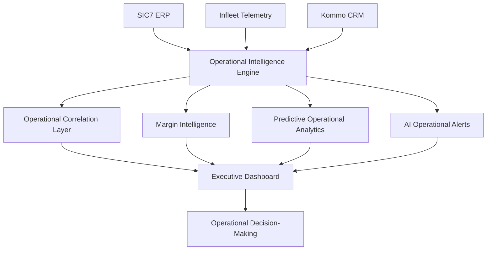
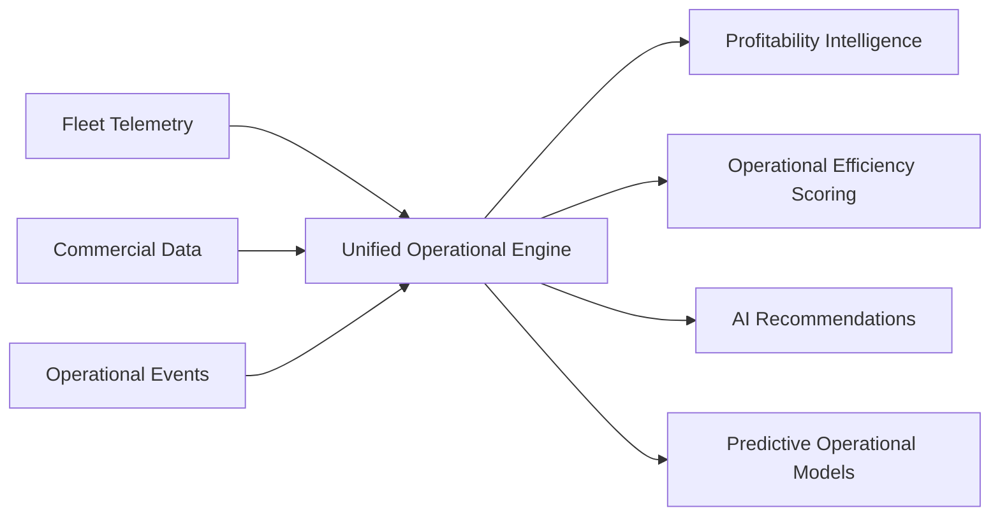

# OpsCore Command Center

  <strong>AI-Powered Operational Intelligence Platform</strong>

  Real-time fleet intelligence, operational analytics and logistics profitability optimization.

  OpsCore positions itself as an operational intelligence layer between fleet telemetry and business profitability.

---

## Platform Overview

OpsCore is an enterprise operational intelligence platform designed to transform raw fleet telemetry, logistics behavior and operational events into real-time strategic decision-making.

Traditional dashboards are reactive.

OpsCore is designed to become:

- predictive;
- prescriptive;
- operational-first;
- AI-assisted;
- profitability-oriented.

The objective is not monitoring.

The objective is operational profitability through real-time intelligence.

OpsCore correlates operational telemetry, logistics behavior and financial outcomes into a unified intelligence engine.

---

## Why This Matters

Logistics operations are increasingly pressured by:

- rising fuel costs;
- shrinking operational margins;
- fleet inefficiencies;
- poor operational visibility;
- disconnected systems;
- reactive operational management;
- hidden profitability destruction.

Most companies monitor operations.

Very few truly understand operational profitability in real time.

OpsCore exists to solve this gap.

---

## Product Vision

OpsCore is designed to become the operational command center for logistics and fleet-intensive businesses.

The platform centralizes:

- operational intelligence;
- financial visibility;
- logistics efficiency;
- fleet telemetry;
- predictive operational analytics;
- AI-driven operational recommendations.

The long-term objective is to evolve from operational analytics into autonomous operational intelligence.

---

## Core Capabilities

### Operational Intelligence
- real-time operational command center;
- live fleet monitoring;
- operational alerts;
- logistics visibility;
- operational anomaly detection.

### Financial Intelligence
- revenue per kilometer;
- operational margin estimation;
- fuel cost optimization;
- profitability analytics;
- operational efficiency scoring.

### Fleet Intelligence
- vehicle utilization analysis;
- idle time monitoring;
- maintenance intelligence;
- fuel efficiency analysis;
- fleet availability tracking.

### AI & Predictive Operations
- predictive maintenance;
- intelligent operational recommendations;
- anomaly detection;
- operational risk identification;
- prescriptive operational guidance.

### Executive Analytics
- operational KPIs;
- profitability dashboards;
- operational rankings;
- margin intelligence;
- multi-layer operational analysis.

---

## Enterprise Design Philosophy

OpsCore is intentionally designed with:

- high-density operational layouts;
- low-friction UX;
- enterprise-grade visual hierarchy;
- real-time operational perception;
- command-center aesthetics;
- operational-first navigation;
- high-speed decision visibility.

The interface prioritizes operational readability over visual decoration.

---

## Live Platform

### Production Preview
- https://opscore.ph3digital.com.br

### GitHub Repository
- https://github.com/PhilipeOliveiraS/opscore-command-center

---

## Operational Architecture

---

## Intelligence Architecture

---

## Current Dashboard Preview

---
## Product Evolution

| Version | Objective |
|---|---|
| V0 | Enterprise operational prototype |
| V1 | Multi-tenant operational SaaS |
| V2 | Predictive operational intelligence |
| V3 | Prescriptive AI operational engine |
| V4 | Autonomous operational copilots |
| V5 | Cross-company operational benchmarking |

---

## Planned AI Layer

Future AI capabilities include:

- predictive operational analytics;
- intelligent anomaly detection;
- operational recommendation engine;
- predictive maintenance intelligence;
- operational profitability forecasting;
- AI operational copilots;
- autonomous operational optimization.

---

## Deployment Architecture

| Layer | Technology |
|---|---|
| Frontend | Next.js App Router |
| Language | TypeScript |
| UI System | shadcn/ui |
| Styling | Tailwind CSS |
| Motion System | Framer Motion |
| State Management | Zustand |
| Visualization | Recharts |
| Hosting | Vercel |
| Backend Services | Python-based operational services |
| Future Database | PostgreSQL |
| Future Realtime | WebSockets / SSE |
| Future AI Layer | Python ML Services |

---

## Engineering Principles

OpsCore is being engineered with the following principles:

- avoid overengineering;
- maximize operational clarity;
- reduce infrastructure costs;
- optimize scalability;
- maintain enterprise-grade UX;
- prioritize modular architecture;
- AI-ready foundation from day one;
- operational-first design philosophy.

---

## Current Development Status

### Current Phase
- V0 operational intelligence prototype.

### Current Priorities
- mobile operational interface;
- realtime operational simulation;
- AI operational alerts;
- advanced operational animations;
- operational responsiveness;
- predictive operational layer.

---

## Strategic Positioning

OpsCore is not a dashboard platform.

OpsCore is an operational intelligence layer for logistics operations.

The platform is designed to evolve into an AI-driven operational decision system capable of transforming telemetry and operational behavior into measurable profitability gains.

---

## Author

### PH3 Digital
Operational Intelligence • AI Systems • Enterprise Platforms

- https://linkedin.com/in/philipeoliveiras
- https://ph3digital.com.br
- https://opscore.ph3digital.com.br
- https://github.com/PhilipeOliveiraS